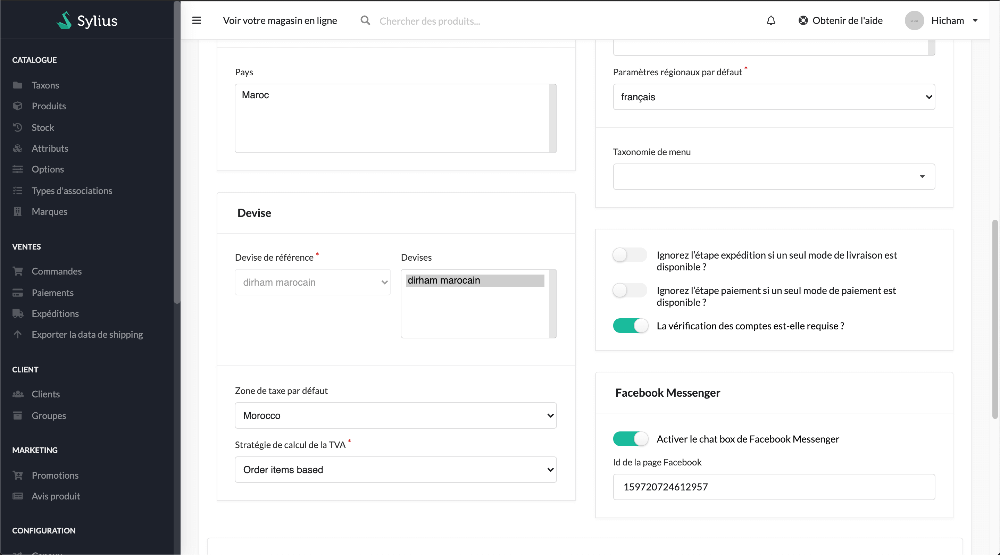
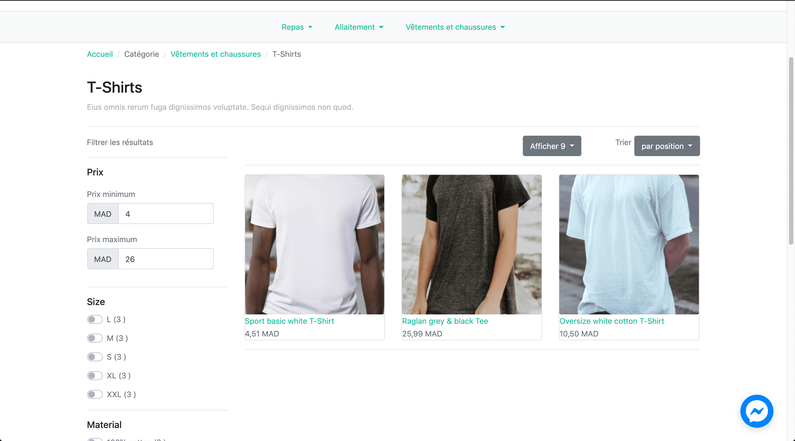
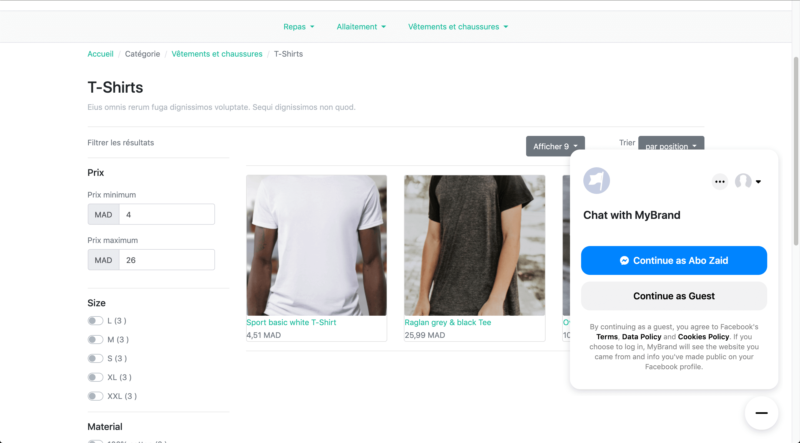

<p align="center">
    <a href="https://monsieurbiz.com" target="_blank">
        
    </a>
    &nbsp;&nbsp;&nbsp;&nbsp;
    <a href="https://sylius.com" target="_blank">
        
    </a>
</p>

<h1 align="center">Facebook Messenger</h1>

A facebook messenger plugin to embed the chat box for Sylius.

## Features
### enable the chat box & set the page id from the back office

### inject the chat box directly via template event



## Installation

Require the plugin :  
`composer require fitratech/sylius-facebook-messenger`

> If you are using Symfony Flex skip the bundles.php modification.

Modify `config/bundles.php` to add this line at the end : 
```
    FitraTech\SyliusFacebookMessengerPlugin\FitraTechSyliusFacebookMessengerPlugin::class => ['all' => true],
```
## Usage

1. Your `Channel` entity need to implement the `FitraTech\SyliusFacebookMessengerPlugin\Model\ChannelInterface` interface and use the `FitraTech\SyliusFacebookMessengerPlugin\Model\ChannelTrait` trait.

2. You need to run a diff of your doctrine's migrations: `bin/console doctrine:migrations:diff`. Don't forget to run it! (`bin/console doctrine:migrations:migrate`)

3. Override `SyliusAdminBundle/Channel/_form.html.twig` (if you are not familiar with template overriding check [the official doc](https://docs.sylius.com/en/latest/customization/template.html)) and include `@FitraTechSyliusFacebookMessengerPlugin/Channel/form.html.twig`
    ````
    <div class="ui hidden divider"></div>
    
    ````

## Front customization

You can override the chat box templates in your theme  (`src/FitraTechSyliusFacebookMessengerPlugin/Resources/views/embed.html.twig`)

## Local Development
Facebook Messenger chat box require a fully qualified domain name (FQDN) localhost & ip doesn't work, you need  to setup a local domain if you use symfony cli follow the [official doc](https://symfony.com/doc/current/setup/symfony_server.html#local-domain-names) and or [this blog post](https://sourcebox.be/set-up-and-use-symfony-local/)
